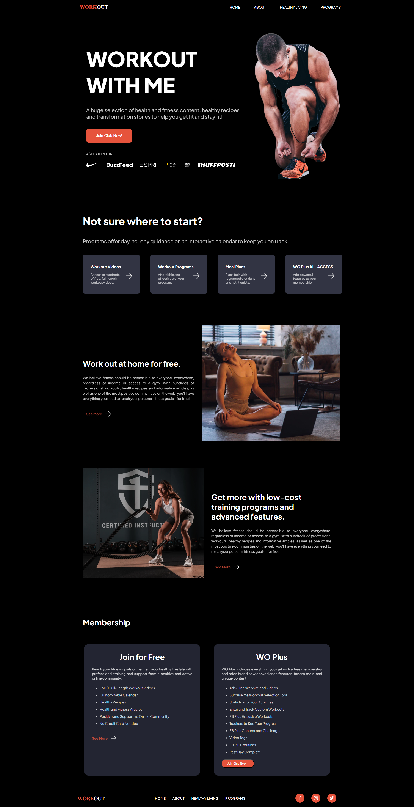

<h1 align="center"> Workout </h1>

Projeto desenvolvido com HTML, CSS e Javascript a partir de um design criado no [FIGMA](https://www.figma.com/file/savnaf8IXwYKtXsMZtquem/Exploration-Workout-%26-Fitness---Landing-Page-(Community)?type=design&t=dLPTeNYETsqplp5f-6)

  <a href="#-tecnologias">🚀 Tecnologias</a>&nbsp;&nbsp;&nbsp;|&nbsp;&nbsp;&nbsp;
  <a href="#-projeto">💻 Projeto</a>&nbsp;&nbsp;&nbsp;|&nbsp;&nbsp;&nbsp;
  <a href="#-contribuição"> 📋 Contribuição</a>&nbsp;&nbsp;&nbsp;|&nbsp;&nbsp;&nbsp;
  <a href="#-layout">🔖 Layout</a>&nbsp;&nbsp;&nbsp;|&nbsp;&nbsp;&nbsp;
  <a href="#-licença">📝 Licença</a>

 

  

## 🚀 Tecnologias

Esse projeto foi desenvolvido com as seguintes tecnologias:

 

## 💻 Projeto

Workout é uma landing page de um aplicativo de exercícios físicos, criado com [HTML](https://developer.mozilla.org/pt-BR/docs/Web/HTML), [CSS](https://developer.mozilla.org/pt-BR/docs/Web/CSS) e [Vanilla JS](http://vanilla-js.com/). Neste projeto foram explorados o uso de variáveis, importação de arquivos, utilização das propriedades flex e position em CSS, além da criação de animações suaves e sutis. As classes do projeto foram criadas atendendo os requisitos do método de nomenclatura [BEM](https://getbem.com/introduction/), além de manter uma estrutura de arquivos e pastas bem organizada, se valendo dos princípios de escrever código limpo.

 

## 📋 Contribuição

Se você deseja contribuir para este projeto, fique à vontade para fazer um fork e enviar suas melhorias por meio de pull requests. Sua contribuição será muito bem-vinda!

 

## 🔖 Layout

Você pode acessar o site através [DESSE LINK](https://thiagomonts.github.io/landing_page_workout/).

 

## 📝 Licença

Esse projeto está sob a licença MIT.

---

Desenvolvido por [Thiago Honorato](https://www.linkedin.com/in/honoratothiago/)
